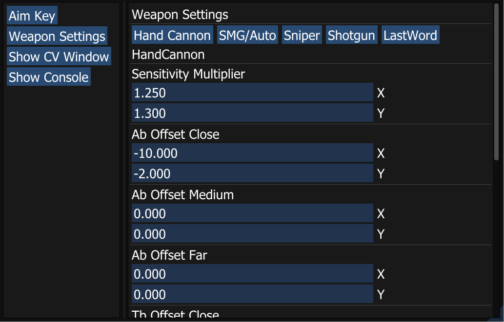

# ***Work In Progress****

# Description

- Trained AI with 10 000 manually labeled images from the video game destiny 2.

- Achieved a 100% detection rate with a .0082 average lost using Darknet YoloV4 algorithm after 2 weeks training (1 million iterations) on my RTX 3080.

- Version 1.0 was in Python but I went to C++ for more speed, with my 3080 on python I was getting 10-20fps , and in C++ 70-100fps

- I use an Arduino Leonardo and a USB Shield to simulate mouse movement.

- Arduino is connected and recognize as Mouse by Windows 10.

- I capture every frame with the help of a capture card, the AI analyze the image for an enemy.

- Undetectable by industry standard Anti-Cheat because no code run on the gaming OS, Enemy coordinates are sent via Serial Port to the Arduino.

- Created a GUI with the framework ImGui to adjust Aimbot settings without having to recompile every time.

# Demo 

https://www.youtube.com/watch?v=v_eh72oScWw
